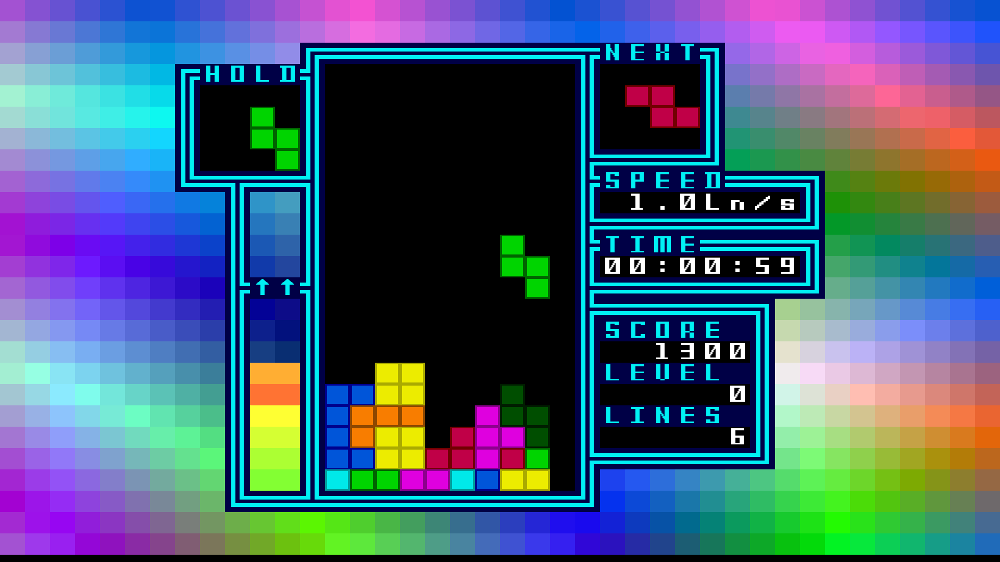
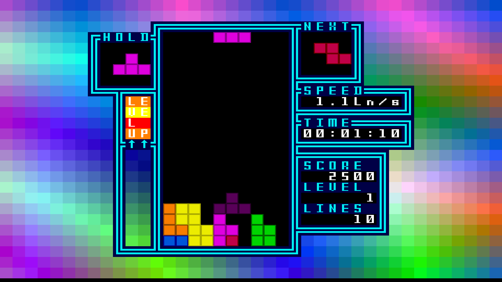
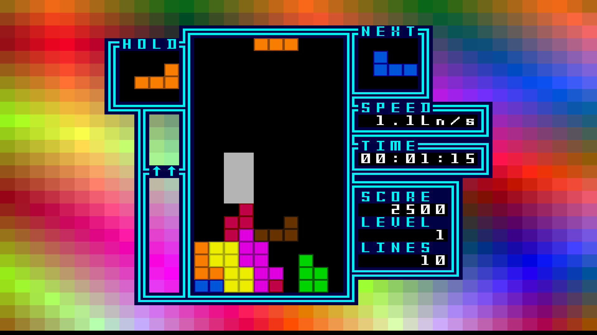
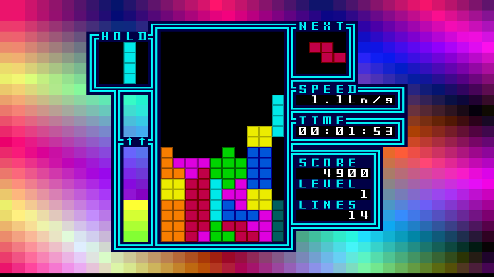
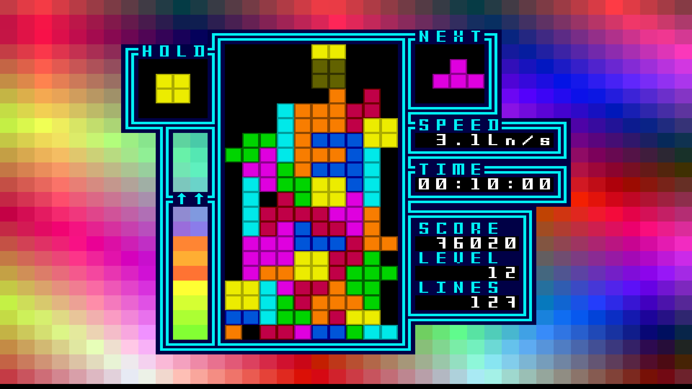
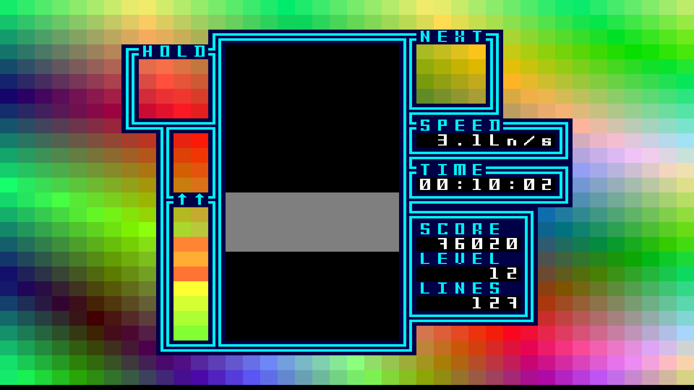
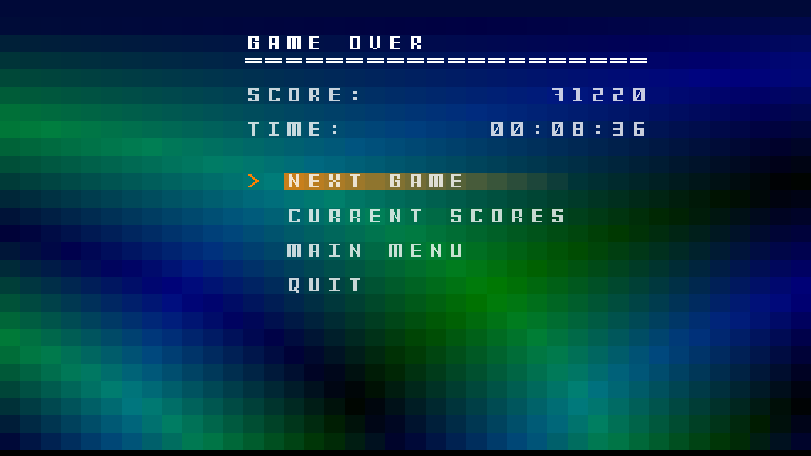

# TetrisD3
## Game Description
TetrisD3 (Tetris Dec 3) is a variation of the original Tetris.

Lines can be cleared by moving different tetrominoes dropping onto the playfield. Then the player can get points for scores based on how many lines cleared.
### Screenshots












### Definitions
- **tetromino**
- **playfield**
### Score System
| Level | single line | double line | triple line | tetris |
| --- | --- | --- | --- | --- |
| 0 | 40 | 100 | 300 | 1200 |
| 1 | 80 | 200 | 600 | 2400 |
| 2 | 120 | 300 | 900 | 3600 |
| n | 40(n + 1) | 100(n + 1) | 300(n + 1) | 1200(n + 1) |
### Defualt keys
* UP = W
* DOWN = S
* LEFT = A
* RIGHT = D
* ROTATE_RIGHT = W
* ROTATE_LEFT = Q
* DROP = Space
* PAUSE = Escape
* CONFIRM = Return
## Assets
- audio
- fonts
- tilesets
- txt
    - tetrominoes.txt: the texture of tetrominoes
    - title.txt: the image of the title screen
    - UI.txt: the image of the playfield interface
## Configuration
the configuration file is under config/config.txt
## Prerequisties
SDL2 support
## Build
```
    cmake . && make
```
## Run
```
    ./TetrisD3
```
## Author
Daniel Hongyu Ding
## References
- Tetris Wiki | Fandom
